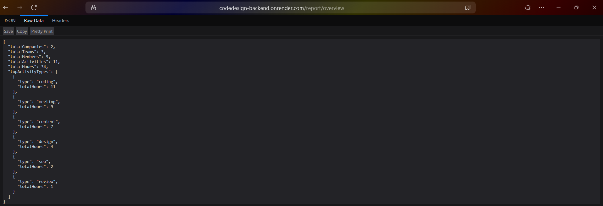
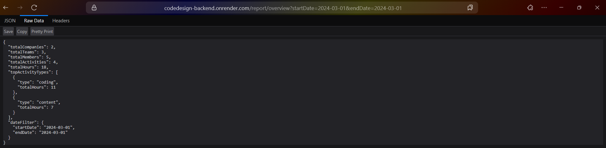
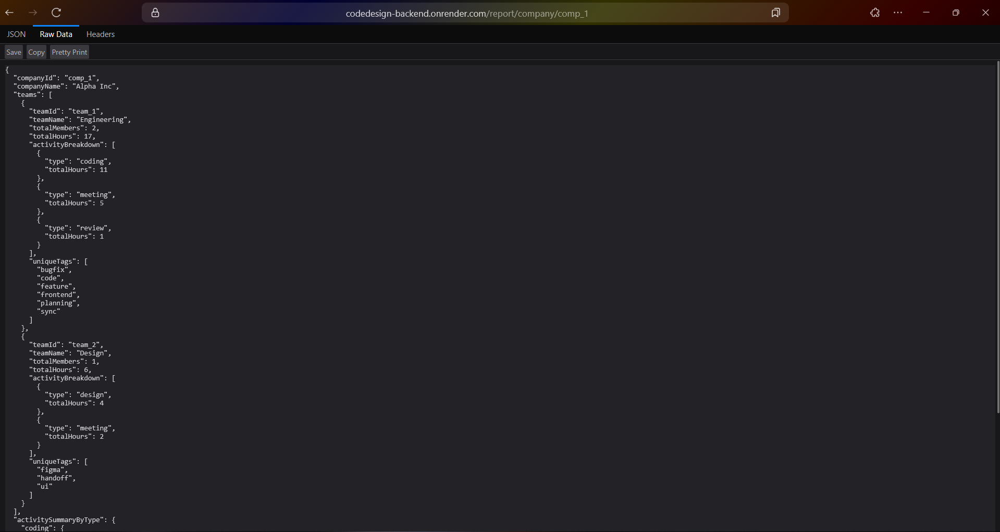
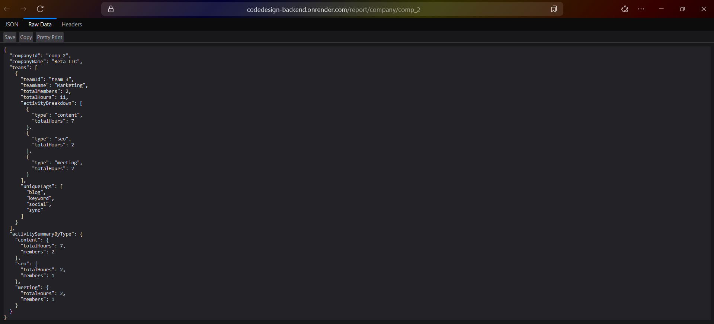
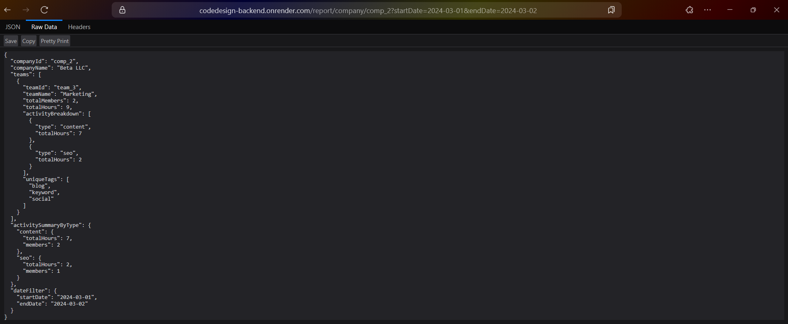
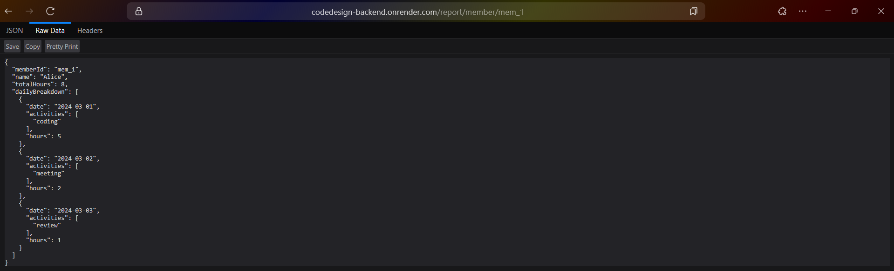
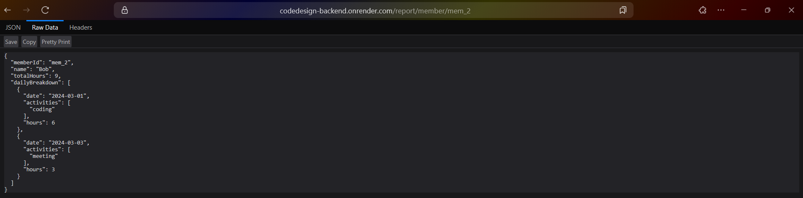
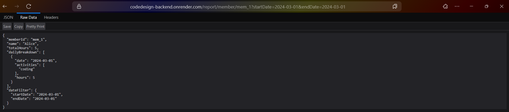

# [CodeDesign Backend Task](https://codedesign-backend.onrender.com/report/overview)

## Hosted [URL](https://codedesign-backend.onrender.com/report/overview)

A Node.js + Express backend for a B2B SaaS dashboard that provides companies insights into their **team's productivity** based on logged activities.

Each company has multiple **teams**, and each team has multiple **members**. Members log their daily activities, including the **type of activity**, **hours spent**, and **tags**

## Setup Instructions

### Prerequisites

- Node.js (v22 or higher)
- npm

### Installation

1. **Clone the repository**

   ```bash
   git clone https://github.com/alvinsjoy/codedesign-backend.git
   cd codedesign-backend
   ```

2. **Install dependencies**

   ```bash
   npm install
   ```

3. **Start development server**

   ```bash
   npm run dev
   ```

4. **Build for production** (optional)

   ```bash
   npm run build
   npm start
   ```

The server will be running at `http://localhost:3000`

## Testing

```bash
# Overview
curl https://codedesign-backend.onrender.com/report/overview

# Company report
curl https://codedesign-backend.onrender.com/report/company/comp_1

# Member report
curl https://codedesign-backend.onrender.com/report/member/mem_1

# With date filtering
curl "https://codedesign-backend.onrender.com/report/overview?startDate=2024-03-01&endDate=2024-03-02"
```

### 1. GET /report/overview

Returns a summary report across all companies.

#### Query Parameters (Optional)

- `startDate` (string): Filter from date (YYYY-MM-DD)
- `endDate` (string): Filter to date (YYYY-MM-DD)

#### Sample Response

```json
{
  "totalCompanies": 2,
  "totalTeams": 3,
  "totalMembers": 5,
  "totalActivities": 11,
  "totalHours": 34,
  "topActivityTypes": [
    {
      "type": "coding",
      "totalHours": 11
    },
    {
      "type": "meeting",
      "totalHours": 9
    },
    {
      "type": "content",
      "totalHours": 7
    },
    {
      "type": "design",
      "totalHours": 4
    },
    {
      "type": "seo",
      "totalHours": 2
    },
    {
      "type": "review",
      "totalHours": 1
    }
  ]
}
```

#### Test with Hoppscotch

- [Overview](https://hopp.sh/r/GUYte3e9IWhV)



- [Overview with Date Filter](https://hopp.sh/r/TOTORpWAjQ5O)



### 2. GET /report/company/:companyId

Returns analytics grouped by team.

#### Path Parameters

- `companyId` (string): Company ID (e.g., "comp_1", "comp_2")

#### Query Parameters (Optional)

- `startDate` (string): Filter from date (YYYY-MM-DD)
- `endDate` (string): Filter to date (YYYY-MM-DD)

#### Sample Response (for comp_2)

```json
{
  "companyId": "comp_2",
  "companyName": "Beta LLC",
  "teams": [
    {
      "teamId": "team_3",
      "teamName": "Marketing",
      "totalMembers": 2,
      "totalHours": 11,
      "activityBreakdown": [
        {
          "type": "content",
          "totalHours": 7
        },
        {
          "type": "seo",
          "totalHours": 2
        },
        {
          "type": "meeting",
          "totalHours": 2
        }
      ],
      "uniqueTags": [
        "blog",
        "keyword",
        "social",
        "sync"
      ]
    }
  ],
  "activitySummaryByType": {
    "content": {
      "totalHours": 7,
      "members": 2
    },
    "seo": {
      "totalHours": 2,
      "members": 1
    },
    "meeting": {
      "totalHours": 2,
      "members": 1
    }
  }
}
```

#### Test with Hoppscotch

- [Test Alpha Inc (comp_1)](https://hopp.sh/r/XBp2mOmTtDAs)



- [Test Beta LLC (comp_2)](https://hopp.sh/r/ECQygVr4Blkc)



- [Test with Date Filter](https://hopp.sh/r/sNctEYkmV8G4)



### 3. GET /report/member/:memberId

Returns daily activity log for a specific member.

#### Path Parameters

- `memberId` (string): Member ID (e.g., "mem_1", "mem_2", etc.)

#### Query Parameters (Optional)

- `startDate` (string): Filter from date (YYYY-MM-DD)
- `endDate` (string): Filter to date (YYYY-MM-DD)

#### Sample Response (for mem_1)

```json
{
  "memberId": "mem_1",
  "name": "Alice",
  "totalHours": 8,
  "dailyBreakdown": [
    {
      "date": "2024-03-01",
      "activities": ["coding"],
      "hours": 5
    },
    {
      "date": "2024-03-02",
      "activities": ["meeting"],
      "hours": 2
    },
    {
      "date": "2024-03-03",
      "activities": ["review"],
      "hours": 1
    }
  ]
}
```

#### Test with Hoppscotch

- [Test Alice (mem_1)](https://hopp.sh/r/RL8p8nsTPGHZ)



- [Test Bob (mem_2)](https://hopp.sh/r/37KDiqMRJIp6)



- [Test with Date Filter](https://hopp.sh/r/Cs4ZPPWwxXWU)



### Bonus Task

#### ActivitySummaryByType in Company Response

Added a new key `activitySummaryByType` to the `/report/company/:companyId` response that provides a flattened summary of all activities across all teams in the company, grouped by activity type.

#### Sample Output

```json
"activitySummaryByType": {
    "coding": {
      "totalHours": 11,
      "members": 2
    },
    "meeting": {
      "totalHours": 7,
      "members": 3
    },
    "review": {
      "totalHours": 1,
      "members": 1
    },
    "design": {
      "totalHours": 4,
      "members": 1
    }
}
```

- **totalHours**: Sum of hours spent on this activity type across all members
- **members**: Total number of unique members (does not double count the same member if they performed the activity more than once)
- Uses **Set** data structure to ensure unique member counting

## Data Structures

### Companies

```typescript
interface Company {
  companyId: string;
  name: string;
  teams: Team[];
}
```

### Teams

```typescript
interface Team {
  teamId: string;
  name: string;
  members: Member[];
}
```

### Members

```typescript
interface Member {
  memberId: string;
  name: string;
  activities: Activity[];
}
```

### Activities

```typescript
interface Activity {
  date: string;
  type: string;
  hours: number;t
  tags: string[];
}
```

## Error Responses

- 404 Not Found

```json
{
  "error": "Company not found"
}
```

- 400 Bad Request (Invalid Date)

```json
{
  "error": "Invalid startDate format. Use YYYY-MM-DD"
}
```

- 500 Internal Server Error

```json
{
  "error": "Internal server error"
}
```
